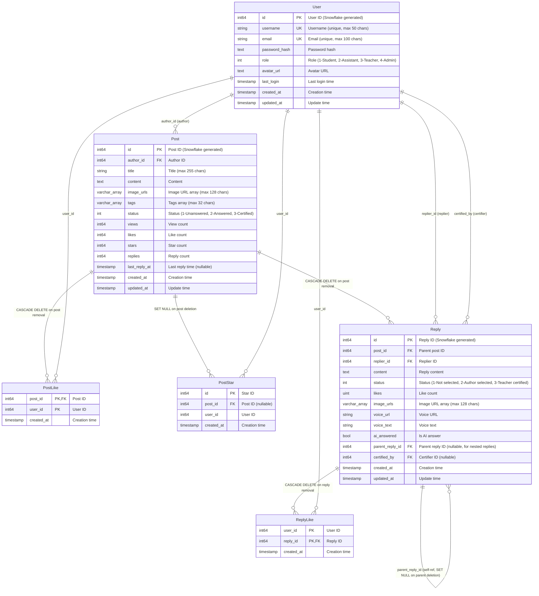

# HEU Math Overflow Database Schema ER Diagram

This document provides a complete Entity-Relationship (ER) diagram for the HEU Math Overflow project database schema.

## Database Overview

The project uses a microservices architecture with three independent PostgreSQL databases:

1. **user_db** - User service database
2. **forum_db** - Forum service database  
3. **audit_db** - Audit service database (reserved, not yet implemented)

## ER Diagram

## Database Tables Details

### 1. User Table (User Service)

**Database**: `user_db`  
**Purpose**: Store all user information in the system

**Fields**:
- `id`: Unique user identifier generated by Snowflake algorithm
- `username`: Username, globally unique
- `email`: Email address, globally unique
- `password_hash`: Hashed password, never stored in plain text
- `role`: User role (1=Student, 2=Assistant, 3=Teacher, 4=Admin)
- `avatar_url`: User avatar storage path
- `last_login`: Last login timestamp
- `created_at`: Account creation time
- `updated_at`: Last account update time

### 2. Post Table (Posts/Questions)

**Database**: `forum_db`  
**Purpose**: Store all forum posts/questions

**Fields**:
- `id`: Unique post identifier generated by Snowflake algorithm
- `author_id`: Author's user ID (references user_db.User.id)
- `title`: Post title
- `content`: Post body content, supports rich text and LaTeX formulas
- `image_urls`: PostgreSQL array type, stores list of image URLs in the post
- `tags`: PostgreSQL array type, stores post tags (e.g., "Calculus", "Linear Algebra")
- `status`: Post status (1=Unanswered, 2=Answered, 3=Certified)
- `views`: View count
- `likes`: Like count
- `stars`: Star/favorite count
- `replies`: Reply count
- `last_reply_at`: Time of last reply received
- `created_at`: Post creation time
- `updated_at`: Last post update time

### 3. PostLike Table (Post Likes)

**Database**: `forum_db`  
**Purpose**: Record user likes on posts

**Fields**:
- `post_id` + `user_id`: Composite primary key, ensures one user can only like a post once
- `created_at`: Like timestamp

**Foreign Key Constraints**:
- `post_id` → `Post.id` (CASCADE DELETE: automatically delete likes when post is deleted)

### 4. PostStar Table (Post Favorites)

**Database**: `forum_db`  
**Purpose**: Record user favorites/stars on posts

**Fields**:
- `id`: Unique favorite record identifier
- `post_id`: Favorited post ID (nullable)
- `user_id`: User ID who favorited
- `created_at`: Favorite timestamp

**Foreign Key Constraints**:
- `post_id` → `Post.id` (SET NULL: when a post is deleted, the post_id is set to NULL but the favorite record is retained)

**Design Note**: Using SET NULL instead of CASCADE DELETE prevents users from losing their favorite list when posts are deleted. However, favorites with NULL post_id represent deleted posts and may need special handling in the UI (e.g., showing as "Post no longer available").

### 5. Reply Table (Replies)

**Database**: `forum_db`  
**Purpose**: Store all replies and comments to posts

**Fields**:
- `id`: Unique reply identifier generated by Snowflake algorithm
- `post_id`: Parent post ID
- `replier_id`: Replier's user ID (references user_db.User.id)
- `content`: Reply content
- `status`: Reply status (1=Normal reply, 2=Author-selected answer, 3=Teacher-certified answer)
- `likes`: Like count for this reply
- `image_urls`: PostgreSQL array type, stores image URLs in the reply
- `voice_url`: Voice reply URL (if any)
- `voice_text`: Voice reply transcription
- `ai_answered`: Flag indicating if this is an AI-generated answer
- `parent_reply_id`: Parent reply ID for nested replies (nullable)
- `certified_by`: Teacher user ID who certified this reply (nullable)
- `created_at`: Reply creation time
- `updated_at`: Last reply update time

**Foreign Key Constraints**:
- `post_id` → `Post.id` (CASCADE DELETE: automatically delete replies when post is deleted)
- `parent_reply_id` → `Reply.id` (SET NULL: set parent_reply_id to NULL when parent reply is deleted)

### 6. ReplyLike Table (Reply Likes)

**Database**: `forum_db`  
**Purpose**: Record user likes on replies

**Fields**:
- `user_id` + `reply_id`: Composite primary key, ensures one user can only like a reply once
- `created_at`: Like timestamp

**Foreign Key Constraints**:
- `reply_id` → `Reply.id` (CASCADE DELETE: automatically delete likes when reply is deleted)

## Database Triggers

The system uses database triggers to automatically maintain statistics:

1. **Post statistics update**: Automatically updates Post.replies when Reply table has insert/delete operations
2. **Like count update**: Automatically updates likes field when PostLike/ReplyLike changes

## Cross-Database Reference Notes

Due to the microservices architecture, the User table is in a separate user_db while Post and Reply tables are in forum_db:

- `Post.author_id` and `Reply.replier_id` reference `User.id` at the application layer
- These fields are **not actual foreign key constraints** at the database level, but referential integrity is maintained through application logic
- This design enables independent service deployment and scaling

## Cache Layer Design

In addition to PostgreSQL persistent storage, the system uses Redis to cache frequently accessed data:

### PostStat (Redis)
Stores real-time post statistics to reduce database read/write pressure:
- `post_id`: Post ID
- `views`: View count
- `likes`: Like count
- `stars`: Star count
- `replies`: Reply count

The system periodically batch-writes Redis statistics back to PostgreSQL.

### Session (Redis)
Stores user session information:
- `session_id`: Session ID
- `user_id`: User ID
- `role`: User role
- `remember`: Remember login state
- `ttl`: Session expiration time

## Data Flow Design

1. **User Registration/Login**: user-service → user_db
2. **Post Creation**: forum-service → forum_db (Post table) + RabbitMQ message queue
3. **AI Auto-Reply**: Asynchronously calls AI service via message queue to generate replies
4. **Like/Favorite**: forum-service → Redis (immediate update) → forum_db (periodic batch write-back)
5. **Search**: forum-service → Elasticsearch (full-text search engine)

## Technology Stack

- **Database**: PostgreSQL 14+
- **Cache**: Redis 7+
- **Message Queue**: RabbitMQ
- **Search Engine**: Elasticsearch
- **Object Storage**: MinIO (for storing images, voice files, etc.)
- **Backend Framework**: Go + Gin + GORM
- **ID Generation**: Snowflake algorithm

## Data Security and Permissions

1. **Password Security**: Uses bcrypt algorithm for password hashing
2. **Session Management**: Uses Redis to store sessions with automatic expiration
3. **Database Permissions**: Each service uses an independent database user with minimal privileges
4. **Cascade Operations**: Properly uses CASCADE and SET NULL to ensure data consistency

## Scalability Considerations

1. **Horizontal Scaling**: Microservices architecture supports independent scaling of each service
2. **Read-Write Separation**: Can configure PostgreSQL master-slave replication for read-write separation
3. **Sharding**: When data volume grows, can shard by time or ID range
4. **Caching Strategy**: Uses Redis to cache hot data, reducing database pressure

---

**Document Version**: 1.0  
**Last Updated**: 2025-12-17  
**Maintainer**: Backend Team
