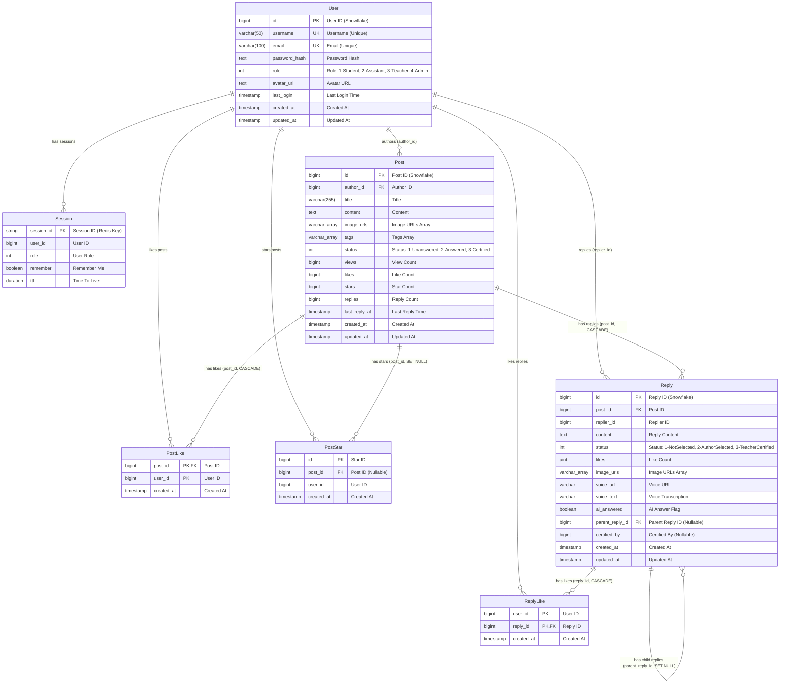

# Database Entity-Relationship Diagram

This document describes the database architecture of the HEUMathOverflow system, including two main databases: user service (user_db) and forum service (forum_db).

## Database Architecture Overview

The system uses a microservices architecture with the following databases:
- **user_db**: User service database, managing user information and sessions
- **forum_db**: Forum service database, managing posts, replies, and related interactions
- **audit_db**: Audit service database (to be implemented)

## ER Diagram



## Database Details

### 1. User Service (user_db)

#### User Table
Stores basic user account information for all system users.

**Features:**
- Uses Snowflake algorithm for distributed ID generation
- Username and email have unique constraints
- Role field supports: Student(1), Assistant(2), Teacher(3), Admin(4)
- Password is hashed, plaintext not stored

#### Session (Redis)
Session information stored in Redis for fast session validation.

**Features:**
- Uses Redis as storage medium with TTL auto-expiration
- Stores user ID and role info to avoid frequent database queries
- Supports "Remember Me" feature with configurable expiration times

### 2. Forum Service (forum_db)

#### Post Table
Main post table storing all questions/posts.

**Features:**
- Supports array type fields (PostgreSQL feature): image URLs, tags
- Status field: Unanswered(1), Answered(2), Certified(3)
- Statistics fields: views, likes, stars, replies
- Records last reply time for sorting and display

**Foreign Keys:**
- `author_id` references User(id) (cross-database logical foreign key)

#### Reply Table
Stores all reply content.

**Features:**
- Supports multimedia replies: text, images, voice
- Supports nested replies: via `parent_reply_id` for comment hierarchy
- AI answer flag: `ai_answered` field marks AI-generated replies
- Certification feature: teachers can select quality answers
- Status: NotSelected(1), AuthorSelected(2), TeacherCertified(3)

**Foreign Keys:**
- `post_id` references Post(id), cascade delete (CASCADE)
- `parent_reply_id` references Reply(id), set null on delete (SET NULL)
- `replier_id` references User(id) (cross-database logical foreign key)

#### PostLike Table
Post like association table, recording user likes on posts.

**Features:**
- Composite primary key: (post_id, user_id)
- Prevents duplicate likes
- Cascade delete: automatically removes likes when post is deleted

#### PostStar Table
Post star/favorite association table, recording user favorites.

**Features:**
- `post_id` can be NULL (keeps favorite record after post deletion)
- Set null on cascade (SET NULL): sets post_id to NULL when post deleted
- Users can view favorite history (even if post deleted)

#### ReplyLike Table
Reply like association table, recording user likes on replies.

**Features:**
- Composite primary key: (user_id, reply_id)
- Prevents duplicate likes
- Cascade delete: automatically removes likes when reply is deleted

## Cross-Database Relationships

Since the system uses a microservices architecture, User data and Forum data are stored in separate databases. These cross-database relationships are maintained through application logic rather than database foreign key constraints:

1. **Post.author_id → User.id**: Post author
2. **Reply.replier_id → User.id**: Reply author
3. **PostLike.user_id → User.id**: User who liked post
4. **PostStar.user_id → User.id**: User who starred post
5. **ReplyLike.user_id → User.id**: User who liked reply

## Index Recommendations

Based on current models and query requirements, the following indexes are recommended:

### user_db
```sql
-- User table already has unique indexes: username, email
```

### forum_db
```sql
-- Post table
CREATE INDEX idx_post_author_id ON posts(author_id);
CREATE INDEX idx_post_status ON posts(status);
CREATE INDEX idx_post_created_at ON posts(created_at DESC);
CREATE INDEX idx_post_last_reply_at ON posts(last_reply_at DESC);

-- Reply table
CREATE INDEX idx_reply_post_id ON replies(post_id);
CREATE INDEX idx_reply_replier_id ON replies(replier_id);
CREATE INDEX idx_reply_parent_reply_id ON replies(parent_reply_id);
CREATE INDEX idx_reply_created_at ON replies(created_at DESC);

-- PostStar table already has indexes: post_id, user_id
-- PostLike table: primary key automatically creates index
-- ReplyLike table: primary key automatically creates index
```

## Data Integrity Constraints

### Cascade Operations Summary

1. **CASCADE (Cascade Delete)**
   - Post → Reply: Delete all replies when post is deleted
   - Post → PostLike: Delete all likes when post is deleted
   - Reply → ReplyLike: Delete all likes when reply is deleted

2. **SET NULL (Set Null on Cascade)**
   - Post → PostStar: Set post_id to NULL in favorites when post is deleted
   - Reply → Reply: Set parent_reply_id to NULL in child replies when parent is deleted

## Caching Strategy

### Redis Cache
- **Session**: User session information
- **PostStat**: Post statistics (views, likes, stars, replies)

Caching reduces database load and improves query performance. Statistics are periodically synced to PostgreSQL.

## Technology Stack

- **Database**: PostgreSQL 
- **Cache**: Redis
- **ORM**: GORM (Go)
- **ID Generation**: Snowflake Algorithm
- **Array Types**: PostgreSQL native array support

## Version Information

- Document Version: 1.0
- Creation Date: 2024-12-17
- Based on Code Version: Current main branch
