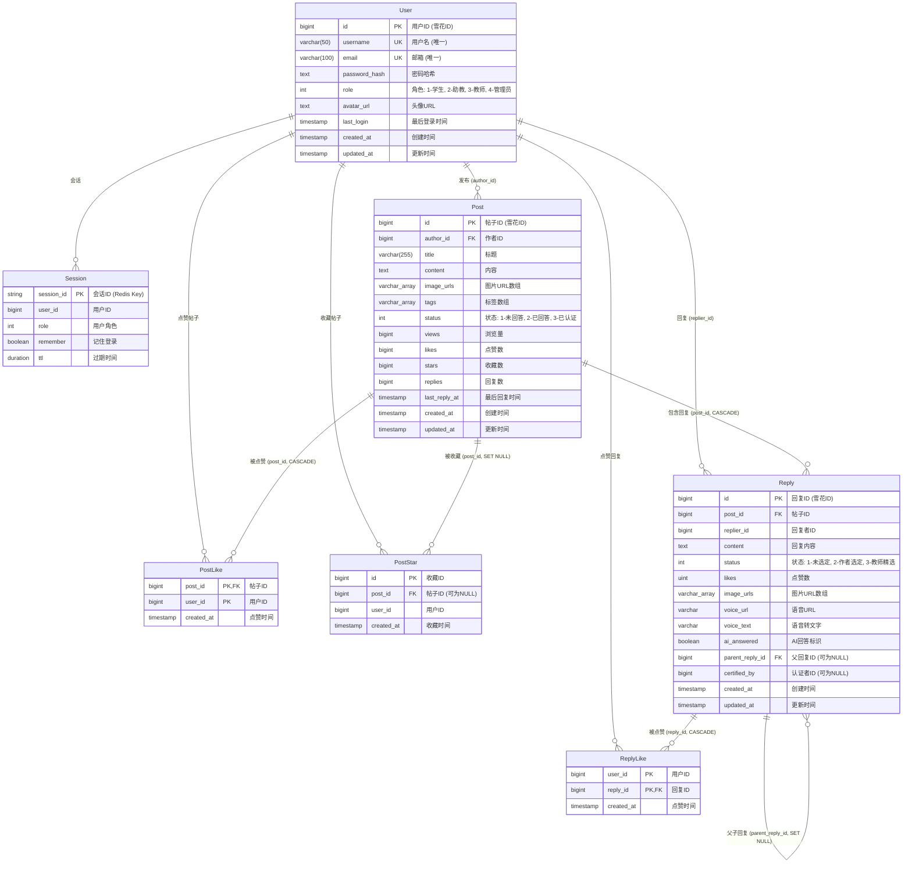

# 数据库ER图 (Database Entity-Relationship Diagram)

本文档描述了HEUMathOverflow系统的数据库架构，包含用户服务(user_db)和论坛服务(forum_db)两个主要数据库。

## 数据库架构概览

系统采用微服务架构，包含以下数据库：
- **user_db**: 用户服务数据库，管理用户信息和会话
- **forum_db**: 论坛服务数据库，管理帖子、回复及相关交互
- **audit_db**: 审计服务数据库 (待实现)

## ER图



## 数据库详细说明

### 1. User Service (user_db)

#### User 表
用户基础信息表，存储系统所有用户的账户信息。

**特点：**
- 使用雪花算法生成分布式ID
- 用户名和邮箱具有唯一约束
- 角色字段支持: 学生(1)、助教(2)、教师(3)、管理员(4)
- 密码经过哈希处理，不存储明文

#### Session (Redis)
会话信息存储在Redis中，用于快速的会话验证。

**特点：**
- 使用Redis作为存储介质，支持TTL自动过期
- 存储用户ID和角色信息，避免频繁查询数据库
- 支持"记住我"功能，可设置不同的过期时间

### 2. Forum Service (forum_db)

#### Post 表
帖子主表，存储所有问题/帖子信息。

**特点：**
- 支持数组类型字段（PostgreSQL特性）：图片URLs、标签
- 状态字段：未回答(1)、已回答(2)、已认证(3)
- 统计字段：浏览量、点赞数、收藏数、回复数
- 记录最后回复时间，用于排序和展示

**外键约束：**
- `author_id` 引用 User(id)（跨数据库逻辑外键）

#### Reply 表
回复表，存储所有回复内容。

**特点：**
- 支持多媒体回复：文本、图片、语音
- 支持嵌套回复：通过`parent_reply_id`实现评论层级
- AI回答标识：`ai_answered`字段标记AI生成的回复
- 认证功能：教师可精选优质答案
- 状态：未选定(1)、作者选定(2)、教师精选(3)

**外键约束：**
- `post_id` 引用 Post(id)，级联删除（CASCADE）
- `parent_reply_id` 引用 Reply(id)，级联置空（SET NULL）
- `replier_id` 引用 User(id)（跨数据库逻辑外键）

#### PostLike 表
帖子点赞关联表，记录用户对帖子的点赞行为。

**特点：**
- 复合主键：(post_id, user_id)
- 防止重复点赞
- 级联删除：帖子删除时自动删除相关点赞记录

#### PostStar 表
帖子收藏关联表，记录用户收藏帖子的行为。

**特点：**
- `post_id` 可为 NULL（帖子被删除后保留收藏记录）
- 级联置空（SET NULL）：帖子删除时将post_id设为NULL
- 用户可查看历史收藏（即使帖子已删除）

#### ReplyLike 表
回复点赞关联表，记录用户对回复的点赞行为。

**特点：**
- 复合主键：(user_id, reply_id)
- 防止重复点赞
- 级联删除：回复删除时自动删除相关点赞记录

## 跨数据库关系说明

由于系统采用微服务架构，User数据和Forum数据分别存储在不同的数据库中。这些跨数据库的关系通过应用层逻辑维护，而非数据库外键约束：

1. **Post.author_id → User.id**: 帖子作者
2. **Reply.replier_id → User.id**: 回复者
3. **PostLike.user_id → User.id**: 点赞用户
4. **PostStar.user_id → User.id**: 收藏用户
5. **ReplyLike.user_id → User.id**: 点赞回复的用户

## 索引建议

基于当前模型和查询需求，建议创建以下索引：

### user_db
```sql
-- User表已有唯一索引: username, email
```

### forum_db
```sql
-- Post表
CREATE INDEX idx_post_author_id ON posts(author_id);
CREATE INDEX idx_post_status ON posts(status);
CREATE INDEX idx_post_created_at ON posts(created_at DESC);
CREATE INDEX idx_post_last_reply_at ON posts(last_reply_at DESC);

-- Reply表
CREATE INDEX idx_reply_post_id ON replies(post_id);
CREATE INDEX idx_reply_replier_id ON replies(replier_id);
CREATE INDEX idx_reply_parent_reply_id ON replies(parent_reply_id);
CREATE INDEX idx_reply_created_at ON replies(created_at DESC);

-- PostStar表已有索引: post_id, user_id
-- PostLike表: 主键自动创建索引
-- ReplyLike表: 主键自动创建索引
```

## 数据完整性约束

### 级联操作总结

1. **CASCADE (级联删除)**
   - Post → Reply: 删除帖子时删除所有回复
   - Post → PostLike: 删除帖子时删除所有点赞
   - Reply → ReplyLike: 删除回复时删除所有点赞

2. **SET NULL (级联置空)**
   - Post → PostStar: 删除帖子时将收藏表的post_id设为NULL
   - Reply → Reply: 删除父回复时将子回复的parent_reply_id设为NULL

## 缓存策略

### Redis缓存
- **Session**: 用户会话信息
- **PostStat**: 帖子统计数据（浏览量、点赞数、收藏数、回复数）

缓存可以减轻数据库压力，提高查询性能。统计数据定期同步到PostgreSQL。

## 技术栈

- **数据库**: PostgreSQL 
- **缓存**: Redis
- **ORM**: GORM (Go)
- **ID生成**: 雪花算法 (Snowflake)
- **数组类型**: PostgreSQL原生数组支持

## 版本信息

- 文档版本: 1.0
- 创建日期: 2024-12-17
- 基于代码版本: 当前主分支
