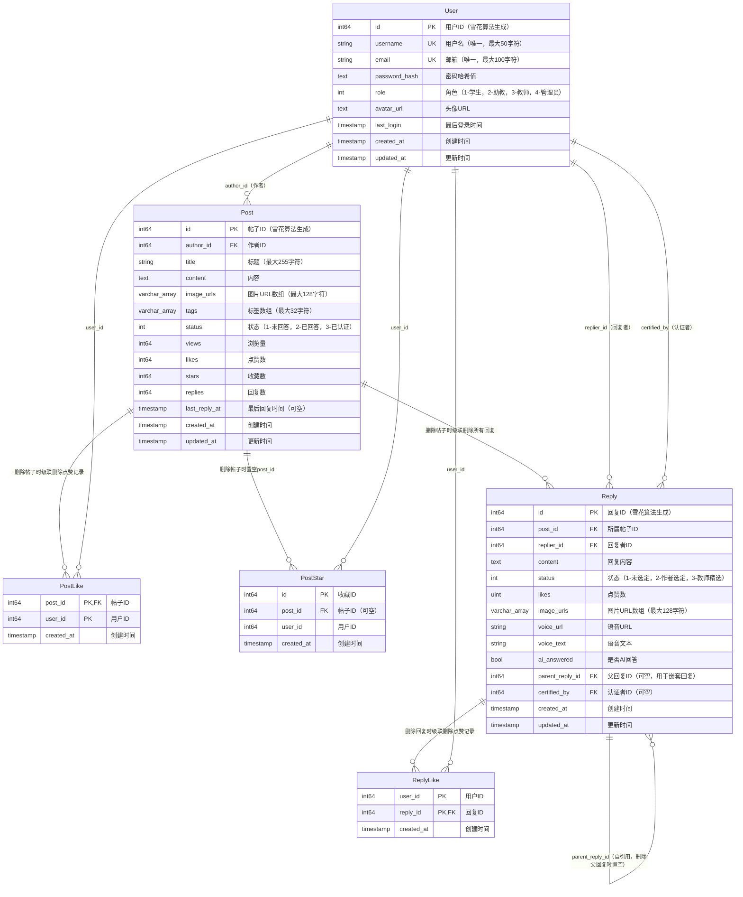

# HEU Math Overflow 数据库架构 ER 图

本文档提供了HEU Math Overflow项目的完整数据库架构实体关系图（ER图）。

## 数据库概览

该项目采用微服务架构，使用三个独立的PostgreSQL数据库：

1. **user_db** - 用户服务数据库
2. **forum_db** - 论坛服务数据库  
3. **audit_db** - 审核服务数据库（预留，暂未实现）

## ER 图

## 数据库表详细说明

### 1. User 表（用户服务）

**数据库**: `user_db`  
**用途**: 存储系统中所有用户的基本信息

**字段说明**:
- `id`: 使用雪花算法生成的唯一用户标识符
- `username`: 用户名，全局唯一
- `email`: 电子邮箱，全局唯一
- `password_hash`: 加密后的密码哈希值，不会明文存储
- `role`: 用户角色，1=学生，2=助教，3=教师，4=管理员
- `avatar_url`: 用户头像存储路径
- `last_login`: 用户最后一次登录的时间戳
- `created_at`: 账户创建时间
- `updated_at`: 账户信息最后更新时间

### 2. Post 表（帖子）

**数据库**: `forum_db`  
**用途**: 存储论坛中的所有帖子/问题

**字段说明**:
- `id`: 使用雪花算法生成的唯一帖子标识符
- `author_id`: 发帖人的用户ID（引用user_db.User.id）
- `title`: 帖子标题
- `content`: 帖子正文内容，支持富文本和LaTeX公式
- `image_urls`: PostgreSQL数组类型，存储帖子中的图片URL列表
- `tags`: PostgreSQL数组类型，存储帖子标签（如"微积分"、"线性代数"）
- `status`: 帖子状态，1=未回答，2=已回答，3=已认证
- `views`: 浏览次数统计
- `likes`: 点赞数统计
- `stars`: 收藏数统计
- `replies`: 回复数统计
- `last_reply_at`: 最后一次收到回复的时间
- `created_at`: 帖子创建时间
- `updated_at`: 帖子最后更新时间

### 3. PostLike 表（帖子点赞）

**数据库**: `forum_db`  
**用途**: 记录用户对帖子的点赞行为

**字段说明**:
- `post_id` + `user_id`: 联合主键，确保一个用户只能对一个帖子点赞一次
- `created_at`: 点赞时间

**外键约束**:
- `post_id` → `Post.id`（级联删除：删除帖子时自动删除相关点赞记录）

### 4. PostStar 表（帖子收藏）

**数据库**: `forum_db`  
**用途**: 记录用户对帖子的收藏行为

**字段说明**:
- `id`: 收藏记录的唯一标识
- `post_id`: 被收藏的帖子ID（可为NULL）
- `user_id`: 收藏者的用户ID
- `created_at`: 收藏时间

**外键约束**:
- `post_id` → `Post.id`（级联置空：删除帖子时将post_id设为NULL，保留收藏记录）

**设计说明**: 使用级联置空而非级联删除，可以避免因帖子删除导致用户收藏列表数据丢失。但post_id为NULL的收藏记录表示该帖子已被删除，需要在UI层面做特殊处理（如显示"帖子已不存在"）。

### 5. Reply 表（回复）

**数据库**: `forum_db`  
**用途**: 存储对帖子的所有回复和评论

**字段说明**:
- `id`: 使用雪花算法生成的唯一回复标识符
- `post_id`: 所属帖子的ID
- `replier_id`: 回复者的用户ID（引用user_db.User.id）
- `content`: 回复内容
- `status`: 回复状态，1=普通回复，2=作者选定的答案，3=教师认证的答案
- `likes`: 该回复获得的点赞数
- `image_urls`: PostgreSQL数组类型，存储回复中的图片URL
- `voice_url`: 语音回复的URL（如果有）
- `voice_text`: 语音回复的文字转录
- `ai_answered`: 标识是否为AI生成的回答
- `parent_reply_id`: 父回复ID，用于支持嵌套回复（可为NULL）
- `certified_by`: 认证该回复的教师用户ID（可为NULL）
- `created_at`: 回复创建时间
- `updated_at`: 回复最后更新时间

**外键约束**:
- `post_id` → `Post.id`（级联删除：删除帖子时自动删除所有回复）
- `parent_reply_id` → `Reply.id`（级联置空：删除父回复时将子回复的parent_reply_id设为NULL）

### 6. ReplyLike 表（回复点赞）

**数据库**: `forum_db`  
**用途**: 记录用户对回复的点赞行为

**字段说明**:
- `user_id` + `reply_id`: 联合主键，确保一个用户只能对一个回复点赞一次
- `created_at`: 点赞时间

**外键约束**:
- `reply_id` → `Reply.id`（级联删除：删除回复时自动删除相关点赞记录）

## 数据库触发器

系统使用数据库触发器来自动维护统计数据：

1. **帖子统计更新**: 当Reply表发生插入/删除操作时，自动更新Post表的replies字段
2. **点赞数更新**: 当PostLike/ReplyLike发生变化时，自动更新对应的likes字段

## 跨数据库引用说明

由于采用微服务架构，User表在独立的user_db中，而Post和Reply表在forum_db中：

- `Post.author_id` 和 `Reply.replier_id` 在应用层引用 `User.id`
- 这些字段在数据库层面**不是真正的外键约束**，而是通过应用层逻辑维护引用完整性
- 这样设计可以实现服务独立部署和扩展

## 缓存层设计

除了PostgreSQL持久化存储外，系统还使用Redis缓存高频访问数据：

### PostStat (Redis)
存储帖子的实时统计数据，减少数据库读写压力：
- `post_id`: 帖子ID
- `views`: 浏览量
- `likes`: 点赞数
- `stars`: 收藏数
- `replies`: 回复数

系统会定期将Redis中的统计数据批量写回PostgreSQL。

### Session (Redis)
存储用户会话信息：
- `session_id`: 会话ID
- `user_id`: 用户ID
- `role`: 用户角色
- `remember`: 是否记住登录状态
- `ttl`: 会话过期时间

## 数据流设计

1. **用户注册/登录**: user-service → user_db
2. **发布帖子**: forum-service → forum_db (Post表) + RabbitMQ消息队列
3. **AI自动回复**: 通过消息队列异步调用AI服务生成回复
4. **点赞/收藏**: forum-service → Redis (即时更新) → forum_db (定期批量写回)
5. **搜索功能**: forum-service → Elasticsearch (全文搜索引擎)

## 技术栈

- **数据库**: PostgreSQL 14+
- **缓存**: Redis 7+
- **消息队列**: RabbitMQ
- **搜索引擎**: Elasticsearch
- **对象存储**: MinIO (存储图片、语音等文件)
- **后端框架**: Go + Gin + GORM
- **ID生成**: 雪花算法（Snowflake）

## 数据安全与权限

1. **密码安全**: 使用bcrypt算法对密码进行哈希加密
2. **会话管理**: 使用Redis存储会话，支持过期自动清理
3. **数据库权限**: 每个服务使用独立的数据库用户，最小权限原则
4. **级联操作**: 合理使用CASCADE和SET NULL确保数据一致性

## 扩展性考虑

1. **水平扩展**: 微服务架构支持独立扩展各个服务
2. **读写分离**: 可配置PostgreSQL主从复制实现读写分离
3. **分库分表**: 当数据量增长时，可按时间或ID范围进行分表
4. **缓存策略**: 使用Redis缓存热点数据，减轻数据库压力

---

**文档版本**: 1.0  
**最后更新**: 2025-12-17  
**维护者**: Backend Team
